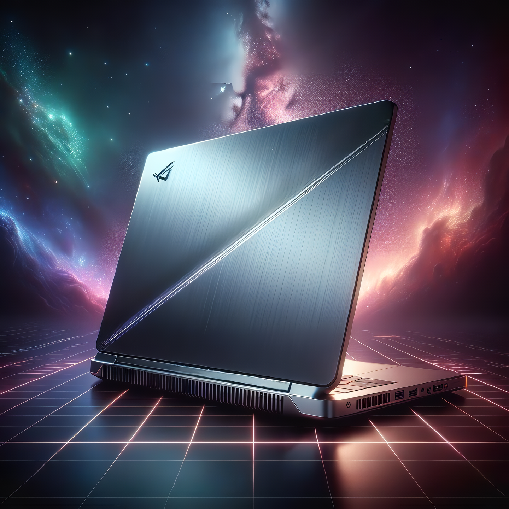

# 제 1회 ASUS ROG X GeForce 노트북 생성형 AI 활용 이미지 공모전

사용 모델 : openai/dall-e-3-HD

```
Image prompt

Title: "ASUS ROG Zephyrus" is a laptop and should emphasize a slim, rounded design.

Image Style: Make the aurora smooth through the connection between warm and cold colors, and use a wide background to show product details. On the floor, Vertical Line and Horizontal Line are intersected to express a sense of distance.

Laptop Image: The top and bottom ends of the laptop are rounded. Emphasize the slim design with lighting focused on the product side. The rear side of the laptop product should be visible, and the laptop should express the texture of high-quality aluminum. The logo of the ROG laptop should be displayed on the back of the laptop. The laptop design should be emphasized by drawing a silver diagonal line from the bottom left to the right of the top. Open the laptop slightly and place it in the center. Emphasize product realism using the Eclipse Gray from "ASUS ROG Zephyrus".

Priority: 1. The aurora in the background should have a vast and mysterious sensibility, and the image should be projected clearer through the screen of the laptop. 2. At the bottom of the laptop, the text "NVIDIA-GEFORCE" should be written clearly and accurately with ASUS Zephyrus text and advertised phrases. 3. The rear side of the product should be visible.
```

## 공모전 기획서

Zephyrus 노트북은 디자인, 성능 두 마리 토끼를 모두 잡은 모델로, 두 분야에서 각각 높은 완성도를 보여 ROG라인업 내에서도 독보적인 포지션을 취하고 있습니다. 이에 다른 라인업에선 볼 수 없는 Zephyrus만의 강점을 극대화하여 이미지로 표현하기 위해 다음 방안들을 구상하였습니다.

1. 측후면 노출을 통한 디자인적 완성도 강조  
   (a) 후면 시그니처 디자인이라고 할 수 있는 사선 형태 로고 하이라이팅  
   (b) ROG 라인업의 아이덴티티를 보여줄 수 있는 ROG 로고 상단 부착  
   (c) 고급스러운 질감 표현을 강조하기 위한 조명처리 및 알루미늄 소재 부각  
   (d) 상하판 라운드 마감을 통한 실 제품 재현 및 부드럽고 고급스러움 연출

2. 우주/은하 배경 활용을 통한 Zephyrus의 재해석  
   (a) Zephyrus는 바람의 신 제피로스를 모티브로 가볍고 뛰어나다는 점을 간접적으로 표현  
   (b) 제피로스가 서풍과 폭풍을 상징한다는 점과 Zephyrus가 주는 고급스러운 이미지를 결합해서 표현하기 위해 플라스마의 폭풍이라고 할 수 있는 오로라를 채택하여 배경으로 구성  
   (c) 고급스럽고 차가운 분위기를 형성하고 있는 Zephyrus이지만, 제품의 디테일이 주는 부드러움을 강조하기 위해 따뜻한 색부터 차가운 색까지 오로라로 연결하여 표현

3. 중앙 배치를 통한 시선집중 유도  
   (a) 측후면 각도배치를 통한 슬림한 옆라인 강조  
   (b) 하단 로고배치를 통해 공백제거 및 제품 상기  
   (c) 매트리스 형태 선의 수렴을 통한 시선 집중화 강조

## 생성이미지 1




## 생성이미지 2


